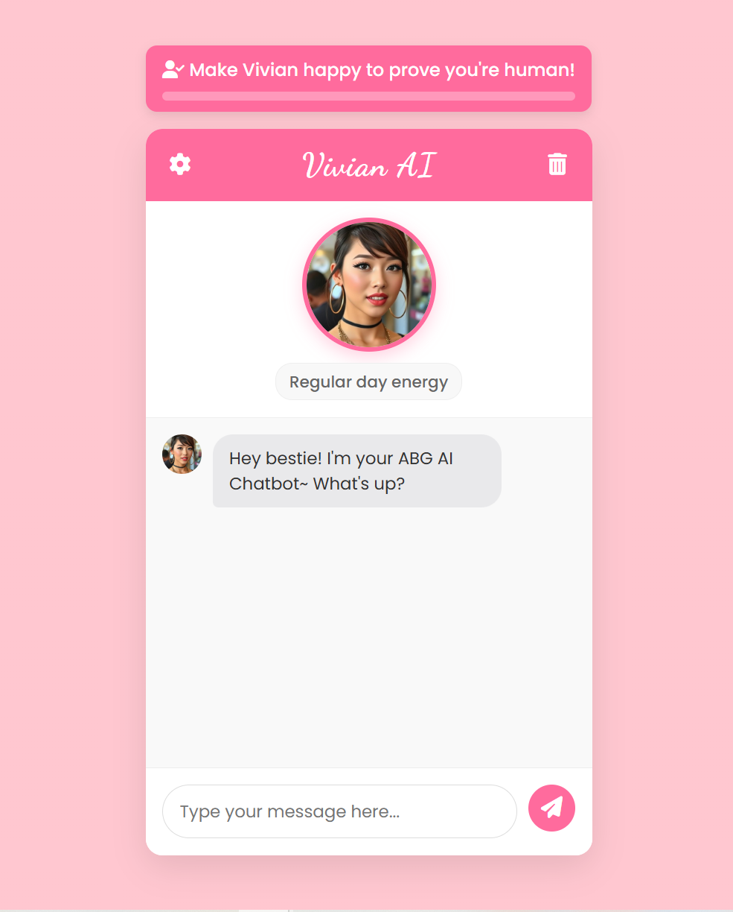

# ABG AI Chatbot: Emotion-Based Human Verification

This project demonstrates a novel approach to human verification through emotional engagement rather than traditional CAPTCHAs. The ABG (Asian Baby Girl) AI Chatbot verifies users are human by requiring them to elicit positive emotional responses from the chatbot - essentially "making the chatbot happy" to prove they possess human empathy and communication skills.



## The Verification System: Core Project Purpose

Unlike conventional verification systems that use puzzles or image recognition, this project explores a more natural interaction paradigm:

1. **Happiness-Based Verification**: Users must make the chatbot happy by sending positive, engaging messages
2. **Emotional Progress Tracking**: The system monitors when messages shift the chatbot's mood from neutral/sad to happy
3. **Visual Feedback**: A progress bar shows how close the user is to verification
4. **Anti-Bot Design**: The system requires genuine human-like interaction that's difficult for bots to simulate

This verification approach offers several advantages:
- More engaging than traditional CAPTCHAs
- Feels like a natural conversation rather than an arbitrary test
- Encourages positive interaction from the start
- Teaches users how to engage effectively with the AI

The verification code in `happiness-verification.js` demonstrates techniques for:
- Tracking emotional state changes
- Implementing debounce mechanisms to prevent gaming the system
- Providing visual feedback without disrupting the conversation flow
- Creating verification systems that don't require server-side validation

## Features Supporting the Verification System

The chatbot includes several features that enhance the human verification experience:

- **Mood Detection**: Analyzes message sentiment using keyword analysis
- **Dynamic Avatar**: Provides visual feedback on the chatbot's current emotional state
- **Multiple Personalities**: Offers different verification experiences based on personality selection
- **Conversation History**: Tracks verification progress between sessions
- **Fallback Responses**: Ensures coherent interactions even without API connections

## Project Structure

```
abg-ai-chatbot/
├── assets/                   # Avatar images for different emotional states
├── happiness-verification.js # Core verification system implementation
├── app.js                    # Chatbot logic and mood detection
├── index.html                # UI structure with verification components
├── styles.css                # Styling including verification progress bar
├── openai-api.js             # Optional AI integration for enhanced responses
├── server.js                 # Node.js server for API connections
└── other support files...
```

## Setup Instructions

### Quick Start (Verification-Only Mode)

1. Clone the repository:
   ```bash
   git clone https://github.com/yourusername/abg-ai-chatbot.git
   cd abg-ai-chatbot
   ```

2. Create an `assets` folder and add avatar images representing different moods:
   - `happy.png` - Avatar with a happy expression
   - `neutral.png` - Avatar with a neutral expression
   - `sad.png` - Avatar with a sad expression

3. Open `index.html` in a web browser to experience the verification system with template responses.

### Full Setup (With Enhanced Responses)

1. Install Node.js dependencies:
   ```bash
   npm install
   ```

2. Create a `.env` file in the root directory:
   ```
   OPENAI_API_KEY=your_openai_api_key
   HUGGINGFACE_API_KEY=your_huggingface_api_key
   ```

3. Start the server:
   ```bash
   npm start
   ```

4. Open `http://localhost:3000` in your browser to use the verification system with AI-enhanced responses.

## How the Verification Works

The verification system in `happiness-verification.js` implements:

1. **Mood State Tracking**: 
   ```javascript
   verificationState = {
     isVerified: false,
     happinessLevel: 0,
     happinessThreshold: 3,  // Points needed to verify
     previousMood: null      // For tracking mood changes
   }
   ```

2. **Happiness Point Awards**: Points are awarded when users successfully change the chatbot's mood to happy
   ```javascript
   if (mood === 'happy' && verificationState.previousMood !== 'happy') {
     verificationState.happinessLevel += 1;
     // Update progress indicator
   }
   ```

3. **Debounce Protection**: Prevents rapid-fire point accumulation
   ```javascript
   // Prevent duplicate awards within a short time period
   const now = Date.now();
   if (now - verificationState.lastHappinessUpdate < 1000) {
     return false;
   }
   ```

4. **Visual Feedback**: Updates the progress bar based on verification status
   ```javascript
   const percentage = Math.min(100, (verificationState.happinessLevel / verificationState.happinessThreshold) * 100);
   progressBar.style.width = `${percentage}%`;
   ```

## Chatbot Personalities

The verification experience changes based on the selected personality:

### ABG (Asian Baby Girl)
- **How to Make Happy**: Use trendy slang, positive emojis, compliments
- **Happy Response**: "Omg yesss! I love that! You're literally serving today!"

### Cute & Sweet
- **How to Make Happy**: Use gentle, kind messages with cute expressions
- **Happy Response**: "Yay! That makes me super duper happy! ♡(ᐢ ᴥ ᐢ)"

### Sassy & Bold
- **How to Make Happy**: Use confident, witty comments with a touch of flattery
- **Happy Response**: "Well, look who just brightened my digital day! I'm impressed."

## Customization

The verification system can be customized:

- **Difficulty Level**: Adjust `happinessThreshold` in `happiness-verification.js`
- **Mood Detection**: Modify the keywords in `moodKeywords` object in `app.js`
- **Verification Messages**: Change feedback texts in `processVerificationResponse()`
- **Progress Indicator**: Style the progress bar in CSS for different visual feedback

## Extensions and Research Applications

This project serves as a foundation for exploring:

- Human-AI emotional interaction patterns
- Alternative CAPTCHA and verification mechanisms
- Emotional intelligence in conversational interfaces
- User engagement through gamified verification

## License

This project is available as open source under the terms of the MIT License.